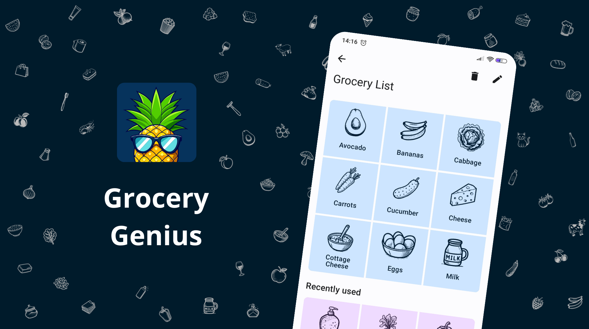
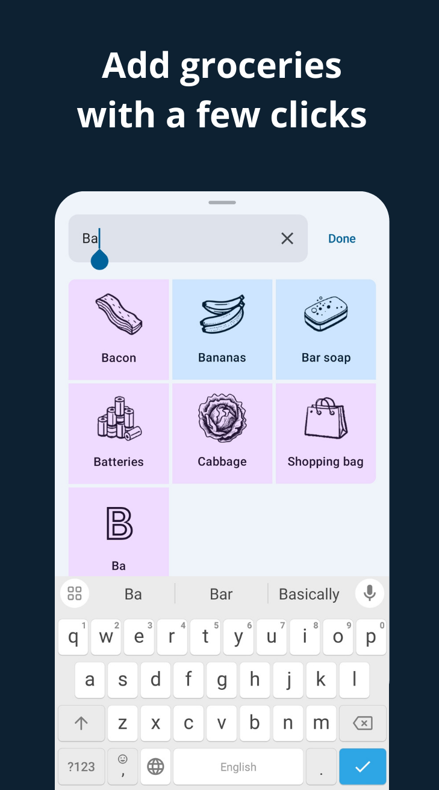
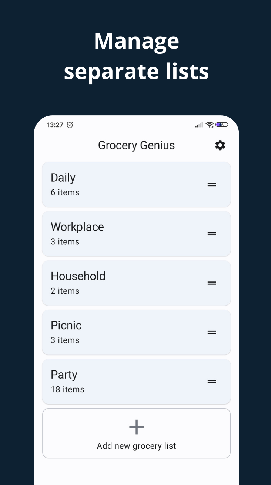
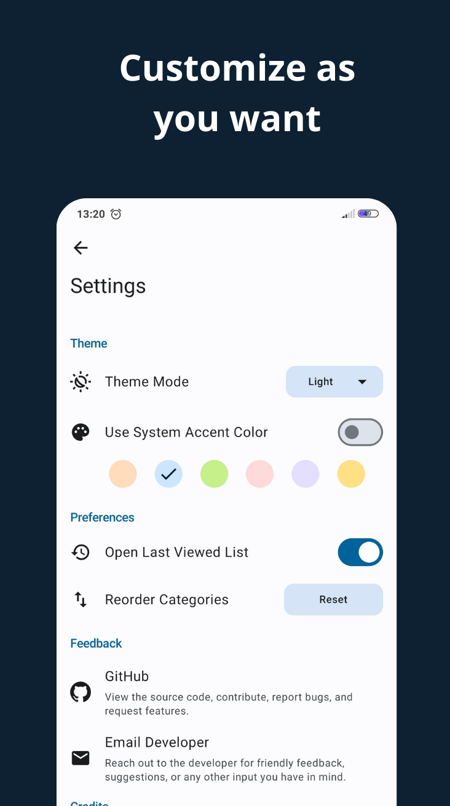

<h1 align="center" style="font-size:28px; line-height:1"><b>Grocery Genius</b></h1>

  

 

 
 

|                                                 |                                               |                                              |
|-------------------------------------------------|-----------------------------------------------|----------------------------------------------|
|  |  |  |

Grocery Genius is a free, customizable shopping list app with a modern design, autocomplete suggestions, offline capabilities, and feature-rich functionality.

## Features

- **Add groceries with a few clicks.** The app has a database of over 130 predefined groceries, each with its own icon. Type as few as two letters, and the best matching items will quickly appear.
- **Add, Edit, and Delete Groceries.** If your grocery item isn’t in the database, it will be created automatically. You can then categorize it, assign an icon, remove it from the list, or delete it entirely.
- **Modern Design.** Unlike many shopping list apps that use a list view, Grocery Genius features a grid view with attractive icons and color-coded separation for purchased and unpurchased items. Groceries are sorted by category, mirroring their placement in stores. The app’s design follows Material You practices, offering dynamic color, dark and light modes, and six color schemes to choose from.
- **Manage Separate Lists.** Create multiple grocery lists and easily reorder them on the main screen with drag-and-drop functionality.
- **Customization.** You can choose a default grocery list, reorder categories, switch between dark and light modes, and choose a different color scheme in the settings.
- **Offline Mode.** The predefined groceries, categories, and icons are bundled with the app, so you can use it fully offline from the first start.
- **Completely Free.** Grocery Genius is free and open source, with no limitations. Add as many grocery lists as you want. All features available now will remain free forever.
- **Respects Your Privacy.** Your confidential data always remains on your device.  Neither the developers nor any third parties have access to your information. For more details, see the [Privacy Policy](https://github.com/DanielRendox/GroceryGenius/blob/develop/PRIVACY_POLICY.md).

## Roadmap

These features may or may not be implemented in the long term.
- Sharing grocery lists with other people
- Location reminders
- Adding photos to items
- Adding items using voice

## Get the app

You can install the app from the [GitHub releases](https://github.com/DanielRendox/GroceryGenius/releases) page or build it yourself by [cloning the project](https://docs.github.com/articles/cloning-a-repository) and launching it in the latest version of [Android Studio](https://developer.android.com/studio).

## Tech stack

- Jetpack Compose for the user interface, with a single Activity and no Fragments
- Room database for local data storage
- AppCompat for per-app language switching
- Preferences DataStore for storing simple data in key-value form
- Kotlin coroutines and flow for asynchronous requests
- Work Manager for synching data in the background
- Moshi for decoding JSON files into Kotlin objects
- Coil for loading images from files in a performant way
- RecyclerView for lists with drag-and-drop functionality
- MVI pattern
- CLEAN architecture with data and presentation layer

## Some Technical Stuff

1. The app has predefined groceries, categories, and icons that are bundled with the APK in the `app/src/main/assets` folder. The app can be switched between the available language variants from the Settings screen, and the selected language is applied to the app UI as well as the bundled data files. Here is how it works:
    - A WorkManager task gets executed on each app startup and synchronizes each repository's data sequentially. The synchronization logic for each repository is defined in its sync function. Some helper functions are used to unify the sync process and catch exceptions that may happen.
    - During the synchronization process each repository reads the localized assets for the selected language and persists them in the local database. The selected language is stored in Preferences DataStore.
    - The app doesn't use Coil to fetch images from the server directly. The icons are bundled with the app and copied into internal storage so they can be loaded efficiently from local files.

2. Drag and drop functionality in the Dashboard and Settings screens is achieved by integrating RecyclerView and ItemTouchHelper with Jetpack Compose. In this setup, composables are items in the RecyclerView, which is in turn a child view in the composable hierarchy. RecyclerView is used because Jetpack Compose doesn't have an official drag-and-drop feature yet.

## Let’s work together!

Grocery Genius is an open-source project that welcomes contributions! If you're inclined to offer support in any of the following areas:

- Building a backend for this app to introduce real-time grocery list-sharing
- Developing features in the [Roadmap](https://github.com/DanielRendox/GroceryGenius/tree/develop#roadmap)
- Porting to iOS
- Design enhancements,
- Translation to different languages,
- Promotion, and spreading the word about the app
- Identifying and reporting bugs,
- Or any other contributions you might have in mind,

and are willing to do so **voluntarily**, please don't hesitate to open an issue, submit a PR, or reach out to [me](https://github.com/DanielRendox) directly.

Whether you're a seasoned developer or just looking to hone your skills, your contributions are much appreciated.

Please note, as per the [GitHub Terms of Service](https://help.github.com/articles/github-terms-of-service/#6-contributions-under-repository-license), any code contributions will be licensed under the GPL v3, as it is the license of the original project.

### 🌍 Translations

If you’d like to help translate the app into different languages, please join the [translation project](https://crowdin.com/project/grocery-genius). Start by translating grocery item names in `default_products.json`, as it is the most important part, then move on to category names, app strings, and the remaining content. If a translation is already completed, you're welcome to vote on the strings or suggest your own version if you feel the existing one could be improved.

## License

The project is licensed under the GPL, which means that you can freely build on top of it for commercial and non-commercial purposes alike. But should you choose to incorporate its code, you must open-source your project and apply the GPL license to it as well. Check out the [LICENSE](https://github.com/DanielRendox/GroceryGenius/blob/develop/LICENSE) file for more details.

However, it does not apply to grocery icons contained in the top-level `assets/icons` folder, and its duplicates inside `app/src/debug/assets/icons`. They were generated by Bing Image Creator and Recraft AI and are owned by the companies behind these services respectively. No commercial use of these icons is allowed.
